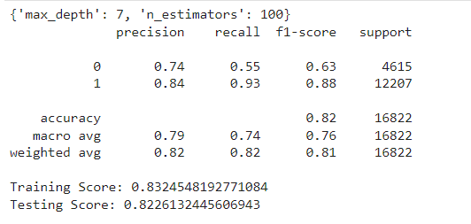
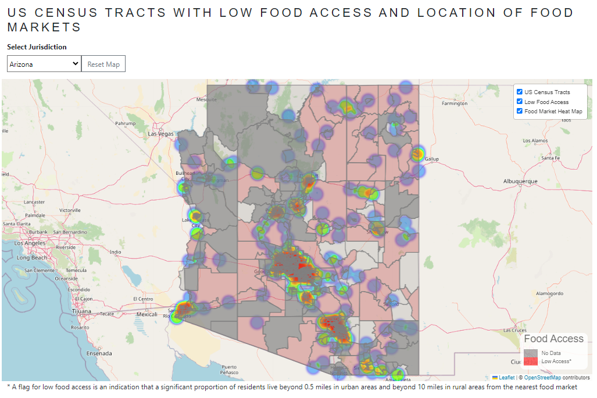

# Project 4: Food Insecurity and Machine Learning

 
# Overview
Sociodemographic risk factors such as low income, unemployment, race/ethnicity,
and disability may predispose people to food insecurity, which is the limited access to healthy food in terms of distance or affordability. people experiencing food insecurity are at higher risk of obesity, chronic diseases, developmental Problems, and poor mental health. Food insecurity is a wide-spread problem with 13.8 million out of 128.6 million households being affected at least part of the year in 2020. (Source: [HHS](https://health.gov/healthypeople/priority-areas/social-determinants-health/literature-summaries/food-insecurity))

For the Food Equity ML project, we conducted an analysis of food insecurity for populations within a 1/2 mile radius for urban census tracts and a 10-mile radius for rural census tracts to identify potential sociodemographic risk factors. To accomplish this, we applied machine learning algorithms to analyze data from the Food Access Research Atlas published by the US Department of Agriculture (UDSA).
We further analyzed the data using geospatial mapping and data visualization tools to explore the dataset for corresponding results. 

# Installation

1. Postgres
    * Create a database named 'food_insecurity'
    * Enter the text from the [SQLSchema file](static/data/SQLSchema.sql) into the food_insecurity query in Postgres
    * 
2. To install the version of libraries/modules, enter this command in your terminal:

```
pip install -r requirements.txt
```

# Methodology
* Project Data sources:
    * [Food Access Dataset](https://www.ers.usda.gov/data-products/food-access-research-atlas/download-the-data/)
    * [Food Market Locations](https://overpass-turbo.eu/)
    * [US Census Tract GeoJSON files](https://www2.census.gov/geo/tiger/TIGER2021/TRACT/)
* Project Wireframe<br>


## Dataframe Creation (ETL) 
* Multiple dataframes were created to support analysis for machine learning and visualizations in Tableau and Leaflet. Datasets created include:
    * State
    * Food_Access_1 - preliminary model; 
    * Food_Access_2 - preliminary model; not enough rows for ML after removing nulls
    * Food_Access_3 - final model used for ML modeling
    * Viz_Data - includes available data for all US census tracts
    * Summary - summary data aggregated by state and national geographic levels

## Geospatial Files

## Extraction (MEEYOUNG)
* Imported the FoodAccessResearchAtlasData2019.csv file as a Pandas dataframe 
* Confirmed a successful import by displaying the dataframe<br>
<br>

## Transformation
* Data was cleaned and organized using the following methods:
    * Slice, apply, round, lambda, drop, dropna, reset_index, isnull, duplicated, sum, describe, tolist, info, rename, groupby, agg, concat, merge, pop, corr
* State FIPS column was added
* Percentage calculations were added   

## Loading (MEEYOUNG)
* LOADED TO POSTGRES

# Machine Learning
Since "Food Access Dataset" is a labeled (LAhalfand10) dataset and has two class labels (0 and 1), we used binary classification supervised machine learning models.

## Date Loading 
* Data was loaded from AWS and confirmed<br>
<br>

## Data Pre-processing
* Added a new column
* Dropped undesired columns
* Moved target feature to the last column
* Checked for null values
* Checked for duplicate values
* Checked correlation matrix for features<br>
<br>

## Split Data into Training/ Testing Sets and Standardize
* Created features (X), by removing the "LAhalfand10" column 
* Created target (y) by using the "LAhalfand10" column 
* Split data into training and testing datasets using train_test_split function
* Standardized data (X) using StandardScaler function 

## Model, Fit, Predict
* Created, trained and scored the following binary classification models to select the best model for our dataset<br>
<br>
<br>

## Random forest classifier and neural network models showed the highest accuracy and hence were selected for further optimization<br>


## Model Optimization
* Data Addition - 13 more columns were added<br>
<br>

* Classification report for bigger Random forest model<br>
<br>

* Accuracy report for bigger Neural Network model<br>
<br>

* Feature Importance<br>
<br>

* Feature Selection Score<br>
<br>

### Random Forest Model Hypertuning with GridSearchCV
* Hypertuning Parameters - to minimize overfitting, max depth and n_estimators were tuned<br>
<br>

* Tuned model classification report<br>
<br>

* Tree plot with best parameter ('max_depth': 7, 'n_estimators': 100)<br>
<br>

# Visualizations
Used Leaflet and Tableau to visualize our data<br>
* Leaflet map: used GeoJson to create a heatmap that shows food access in the US by state<br>
<br>

* Tableau Dashboard: bar charts comparing food access by different demographics<br>
<br>

# Analysis
## Machine Learning
We created multiple dataframes (different feature numbers/ rows) from our dataset and used various binary classification models to get the best performing model. The following are conclusions from our best model (using third dataframe):<br>
* Out of all the binary classification models tested, Random Forest Classifier gave the highest accuracy with overfitting (Training Score: 1.0, Testing Score: 0.84).
*Feature addition improved model accuracy - third dataframe was created by adding 13 more features to first dataframe and it increased the accuracy from 0.78 to 0.82 for random forest classifier and 0.85 for neural network model.
* Feature selection was unhelpful in resolving overfitting issue (Training Score: 0.99, Testing Score: 0.83).
* Hyperparameter tuning ('max_depth': 7, 'n_estimators': 200) resolved the overfitting issue (Training Score: 0.83, Testing Score: 0.82) with some decrease in accuracy (0.84 to 0.82)
* Optimized model has a high recall (0.94) for "label 1" (low access population with food insecurity flag) which means our model is highly efficient in predicting true positives for this class (less false negatives). 

## Leaflet Map (MEEYOUNG)


## Tableau Dashboard (DIPTI)
We had interesting findings with machine learning versus what we found in the Tableau presentation. Our data was based on Secure vs Insecure flag. We used the same indicator against dimensions such as Age, Race, Ethnicity, SNAP Benefits, Housing Units without Vehicle, Household low income to display the presentation of Secure vs non-secure populations. In most of our chart comparisons, there is not a significant difference in terms of %, which ranges between 1-10%. The following are the conclusions from our Tableau analysis: <br>
* In terms of food security, insecure kids are higher in % than secure kids, but for seniors, the opposite is true and secure % is higher than insecure population of seniors. <br>
* A surprising outcome we came across is the fact that there is a higher percentage of food-secure people using SNAP government assistance benefits than non-secure people. <br>
* We also found that distance from a grocery store does not have a significant impact on food security within a 1/2 mile range. <br>
* Within this ½ mile range, there is not a significant difference in food security based on household income, either. <br>
* Secure population without a vehicle is 6% greater than insecure population without a vehicle.<br>

## Limitations
* For machine learning, we ran into issues of usable data after data cleaning, since many columns have multiple null values. For this reason we had to create the third dataframe (final dataframe). The following are the specific limitations for first and second dataframes:
    * First dataframe - Even though the number of rows is high (71,782 rows), the accuracy score is fairly low (0.75).
    * Second dataframe - Even though the accuracy is high (.90), the number of rows is suboptimal (7,708 rows) for machine learning.
* As our data resides on an AWS-S3 bucket , there was a limitation to connect Tableau Public to AWS. Hence, we took another route and used an exported, cleaned, transformed, and modeled .csv file for this purpose.
* Many of data elements were missing values, hence we couldn’t use some important columns which could have given us a better understanding of this dataset.

# References/ Sources
* https://foodtank.com/wp-content/uploads/2022/04/vince-veras-sYaK3SlGwEw-unsplash.jpg
* https://leafletjs.com/
* https://www.tableau.com/
