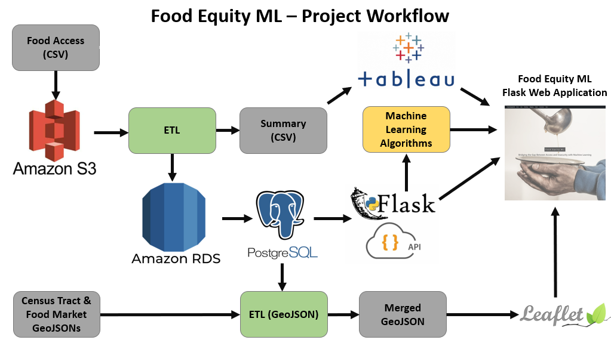
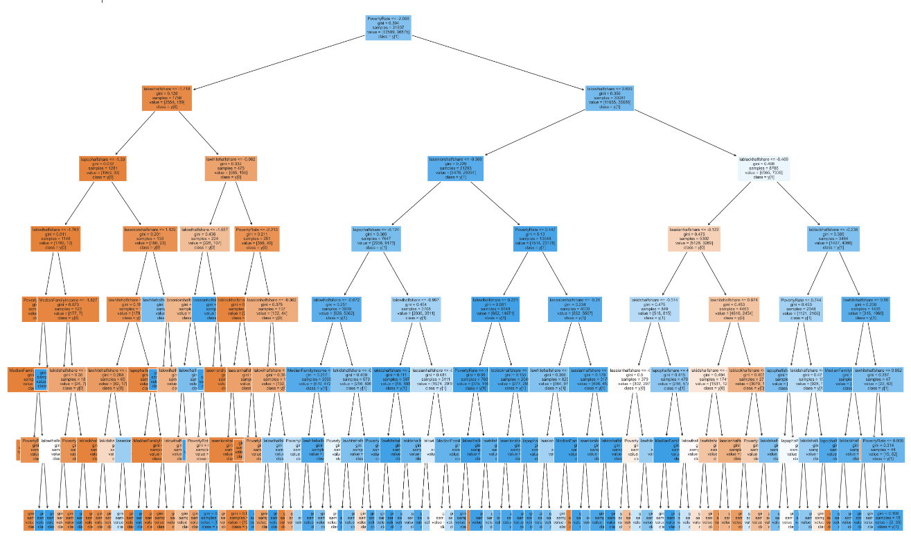
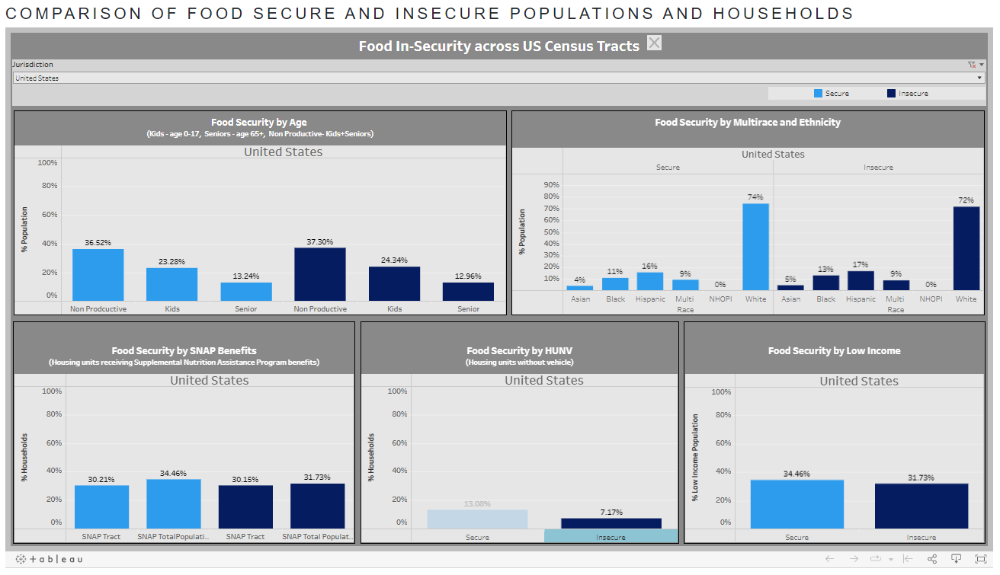
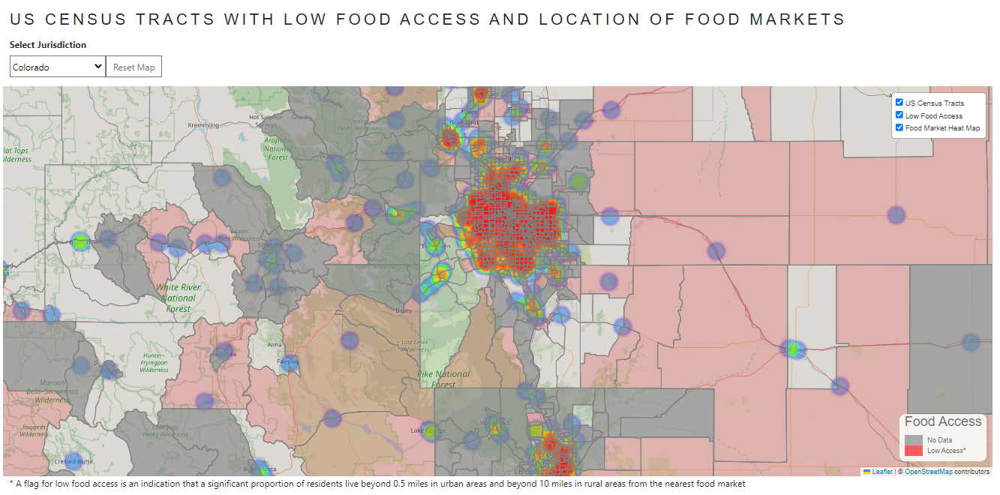

# Project 4: Food Insecurity and Machine Learning

 
# Overview
Sociodemographic risk factors such as low income, unemployment, race/ethnicity,
and disability may predispose people to food insecurity, which is the limited access to healthy food in terms of distance or affordability. people experiencing food insecurity are at higher risk of obesity, chronic diseases, developmental Problems, and poor mental health. Food insecurity is a wide-spread problem with 13.8 million out of 128.6 million households being affected at least part of the year in 2020. (Source: [HHS](https://health.gov/healthypeople/priority-areas/social-determinants-health/literature-summaries/food-insecurity))

For the Food Equity ML project, we conducted an analysis of food insecurity for populations within a 1/2 mile radius for urban census tracts and a 10-mile radius for rural census tracts to identify potential sociodemographic risk factors. To accomplish this, we applied machine learning algorithms to analyze data from the Food Access Research Atlas published by the US Department of Agriculture (UDSA).
We further analyzed the data using geospatial mapping and data visualization tools to explore the dataset for corresponding results. 

# Tools & Libraries
* Database/Tools
    * AWS - RDS & S3 Buckets
    * PGAdmin
    * Tableau
* Languages
    * Python
    * Javascript
    * HTML/CSS
    * PostgreSQL
* Libraries
    * Bootstrap
    * D3
    * Geopandas
    * Leaflet
    * Matplotlib
    * OS
    * Pandas
    * Seaborn
    * SKlearn
    * SQLAlchemy
    * Sys
    * TensorFlow
    * Zipfile

# Methodology
* Project Data sources:
    * [Food Access Research Atlas](https://www.ers.usda.gov/data-products/food-access-research-atlas/download-the-data/)
    * [Food Market Locations GeoJSON](https://overpass-turbo.eu/)
        * The query used to retrieve the data can be found in [geojson-etl.ipynb](static/data/geojson/geojson-etl.ipynb)
    * [US Census Tract GeoJSON files](https://www2.census.gov/geo/tiger/TIGER2021/TRACT/)
* Project Workflow 

## Dataset Preparation (ETL) 
* Multiple dataframes were created to support analysis for machine learning and visualizations in Tableau and Leaflet. Datasets created include:
    * State - index of states
    * Food_Access_1 - preliminary model
    * Food_Access_2 - preliminary model
    * Food_Access_3 - final model used for ML modeling
    * Viz_Data - includes available data for all US census tracts
    * Summary - summary data aggregated by state and national geographic levels

### Extraction (Food Access Research Atlas data)
* Downloaded the FoodAccessResearchAtlasData2019.csv file as a dataframe (72,531 records) and saved to an AWS S3 Bucket 
 

### Transformation
* All datasets
    * Derived State FIPS value
* State summary
    * Created unique list of states in dataset (see [etl.ipynb](static/data/etl.ipynb))
* Dataset for machine learning models (see [etl.ipynb](static/data/etl.ipynb))
    * Removed columns with an excessive number of null fields or that were otherwise not useful for machine learning
    * Deleted rows with any null values
    * Calculated percent population distribution at census tract level for sociodemographic variables
* Dataset for mapping (see [etl.ipynb](static/data/etl.ipynb))
    * Kept columns used for machine learning
    * Did not delete rows with null values in one or more columns
    * Calculated percent population distribution at census tract level for sociodemographic variables
* Dataset for charts (see [etl_state_summary.ipynb](static/data/etl_state_summary.ipynb))
    * Grouped raw data by state level and target variable
    * Calculated percent population distribution at state level for sociodemographic variables of interest

### Loading
* Setup Postgres server in AWS RDS
* Pre-loaded SQL schemas into the Postgres database manager of choice - PGAdmin
* Used SQLAlchemy to load each dataframe to the AWS Postgres server
* The data for the Tableau charts was exported - [summary.csv](static/data/Summary.csv)

### Geospatial Files
1. Downloaded zip folders containing ArcGIS and other shape files the [US Census repository](https://www2.census.gov/geo/tiger/TIGER2021/TRACT/)
2. Merged ArcGIS shapefiles into a GeoJSON file by each state
3. Merged food access data with GeoJSON polygon files by US Census Tract
    * saved as `tl_2021_<state fips>_tract.geojson` in the [data/geojson folder](static/data/geojson/)

# Machine Learning
In the data from the Food Access Research Dataset ("Food Access Data"), our target variable is LAhalfand10 with two class labels (0 and 1). Therefore, we used binary classification supervised machine learning models.

## Date Loading 
* Data was loaded from AWS and confirmed 
 

## Data Pre-processing
* Added a new column
* Dropped undesired columns
* Moved target feature to the last column
* Checked for null values
* Checked for duplicate values
* Checked correlation matrix for features 
 

## Split Data into Training/ Testing Sets and Standardize
* Created features (X), by removing the "LAhalfand10" column 
* Created target (y) by using the "LAhalfand10" column 
* Split data into training and testing datasets using train_test_split function
* Standardized data (X) using StandardScaler function 

## Model, Fit, Predict
* Created, trained and scored the following binary classification models to select the best model for our dataset 
 
 

## Random forest classifier and neural network models showed the highest accuracy and hence were selected for further optimization 

## Model Optimization
* Data Addition - 13 more columns were added 
 

* Classification report for bigger Random forest model 
 

* Accuracy report for bigger Neural Network model 
 

* Feature Importance 
 

* Feature Selection Score 
 

### Random Forest Model Hypertuning with GridSearchCV
* Hypertuning Parameters - to minimize overfitting, max depth and n_estimators were tuned 
 

* Tuned model classification report 
 

* Tree plot with best parameter ('max_depth': 7, 'n_estimators': 100) 
 

# Visualizations
Used Leaflet and Tableau to visualize our data 
* Leaflet map: used GeoJson to create a heatmap that shows food access in the US by state 
 

* Tableau Dashboard: bar charts comparing food access by different demographics 
 

# Analysis
## Machine Learning
We created multiple dataframes (different feature numbers/ rows) from our dataset and used various binary classification models to get the best performing model. The following are conclusions from our best model (using third dataframe): 
* Out of all the binary classification models tested, Random Forest Classifier gave the highest accuracy with overfitting (Training Score: 1.0, Testing Score: 0.84).
* Feature addition improved model accuracy - third dataframe was created by adding 13 more features to first dataframe and it increased the accuracy from 0.78 to 0.82 for random forest classifier and 0.85 for neural network model.
* Feature selection was unhelpful in resolving overfitting issue (Training Score: 0.99, Testing Score: 0.83).
* Hyperparameter tuning ('max_depth': 7, 'n_estimators': 200) resolved the overfitting issue (Training Score: 0.83, Testing Score: 0.82) with some decrease in accuracy (0.84 to 0.82)
* Optimized model has a high recall (0.94) for "label 1" (low access population with food insecurity flag) which means our model is highly efficient in predicting true positives for this class (less false negatives). 

## Leaflet Map
We created the interactive map using LeafletJS with integrated data served through a Flask server API. Features of the map include:
* Selection of data at US census tract level by state
* Interactive layers to overlay US census tract boundaries, food access status, and a heat map to visualize the location of food markets.
* In confirmation of USDA indicators for food insecurity, the location of food markets generally cluster in or near US census tracts that are not flagged for food insecurity 
 

## Tableau Dashboard
We had interesting findings with machine learning versus what we found in the Tableau presentation. In Tableau, we developed our visualizations to compare two cohorts at state and national levels of populations and households with and without food security. We stratified these groups by sociodemographic factors: age, race/ethnicity, SNAP Benefit eligibility, Housing Units without Vehicle (HUNV), and low income. 
* In most of our chart comparisons at the national level, there was not a significant difference in terms of %, which ranged between 1-10%. The following are the conclusions from our Tableau analysis:  
* In terms of food security, there is a higher percentage of insecure kids than secure kids, but for seniors, the opposite is true.  
* Surprisingly, there is a higher percentage of households in  food-secure areas using SNAP government assistance benefits than non-secure households.  
* Likewise, the percentage of households without a car in food secure US census tracts is 6% greater than in food insecure census tracts.  

## Limitations
* The majority of columns in the food access dataset, specifically those related to the number and percentage share of residents living at various distances from food markets, were significantly incomplete. Therefore, we had to drop these columns in order to maintain a dataset large enough for machine learning, and were unable to include additional geospatial reference variables to enhance our analysis.
* The data structure did not allow us to drill-down to subcategories of populations, for instance to identify people of a race/ethnicity that were also low income. We were therefore unable to explore why the % of households without vehicles was greater across census tracts in the US with food security for the majority of their residents, which seems counter-intuitive. One hypothesis is that there could be a higher cumulative number of households in dense population areas with access to food markets that do not require cars versus the cumulative number of households in less populated areas - but we have no means to check it using this dataset.

# Web Visualization
We created a Flask web application to organize and present our machine learning results and charts, as well as to host the interactive map and Tableau dashboard, as seen in screenshots below. 
 
 
 
 
 
 
 

# References/ Sources
* https://foodtank.com/wp-content/uploads/2022/04/vince-veras-sYaK3SlGwEw-unsplash.jpg
* https://leafletjs.com/
* https://www.tableau.com/
